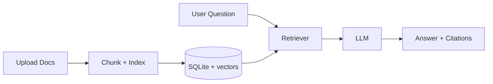

# RAG Engine SaaS

Production-oriented Retrieval-Augmented Generation (RAG) stack with a FastAPI backend and React frontend.

## Overview

This project provides:

- Session-based document ingestion (PDF/TXT/MD/DOCX)
- Chunking + retrieval using embeddings with lexical fallback
- Chat answers with citations
- Optional streaming responses and web-search augmentation
- Multi-provider LLM support (Gemini/OpenAI/Anthropic/Ollama)

## Architecture / Stack

- **Backend:** FastAPI, SQLite, Python 3.11+
- **Frontend:** React + TypeScript + Vite + Mantine
- **Providers:** Gemini, OpenAI, Anthropic, Ollama



## Quickstart

### Prerequisites

- Python 3.11+
- Node.js 18+

### Install backend deps

```bash
cd backend
python3.11 -m venv .venv
source .venv/bin/activate
pip install -r requirements.txt
```

### Install frontend deps

```bash
cd ../frontend
npm install
```

## Env vars

Create backend env file:

```bash
cd backend
cp .env.example .env
```

Key variables:

- `LLM_PROVIDER` (`gemini` | `openai` | `anthropic` | `ollama`)
- `GEMINI_API_KEY` / `OPENAI_API_KEY` / `ANTHROPIC_API_KEY`
- `ENABLE_STREAMING` (default true)
- `ENABLE_WEB_SEARCH` + `TAVILY_API_KEY` (optional)

## Run

### Backend

```bash
cd backend
source .venv/bin/activate
python -m uvicorn app.main:app --reload --host 0.0.0.0 --port 8000
```

### Frontend

```bash
cd frontend
npm run dev
```

Frontend default URL: `http://localhost:5173`
Backend default URL: `http://localhost:8000`

## Test

Backend:

```bash
cd backend
pytest
```

Frontend checks:

```bash
cd frontend
npm run build
```

## Deployment

- Backend can be containerized and deployed as ASGI app.
- Frontend builds as static assets with Vite.

```bash
# frontend
npm run build
```

For architecture and operational notes, see `docs/`.

## API snippets

- `POST /api/sessions`
- `POST /api/sessions/{session_id}/files`
- `POST /api/sessions/{session_id}/chat`
- `POST /api/sessions/{session_id}/chat/stream`
- `GET /api/models`

Example request (`POST /api/sessions/{session_id}/chat`):

```json
{
  "message": "Summarize the uploaded document",
  "temperature": 0.2
}
```

Example response shape:

```json
{
  "answer": "...",
  "citations": [
    {
      "file_name": "example.pdf",
      "score": 0.87,
      "snippet": "..."
    }
  ],
  "used_embeddings": true,
  "model": "gemini-2.5-flash"
}
```

## Troubleshooting

- **No model responses**: confirm provider API key and `LLM_PROVIDER` value.
- **CORS issues**: verify `CORS_ALLOW_ORIGINS` in backend env.
- **Low retrieval quality**: inspect chunking settings and uploaded file quality.
- **Streaming issues**: verify reverse proxy supports SSE.

## Changelog

See [CHANGELOG.md](CHANGELOG.md).

## License

MIT — see [LICENSE](LICENSE).
