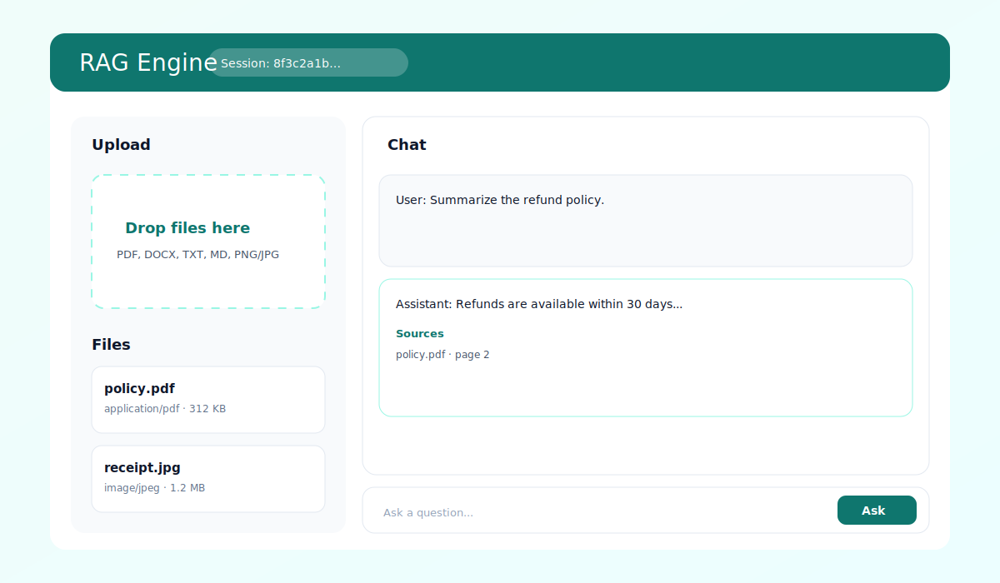
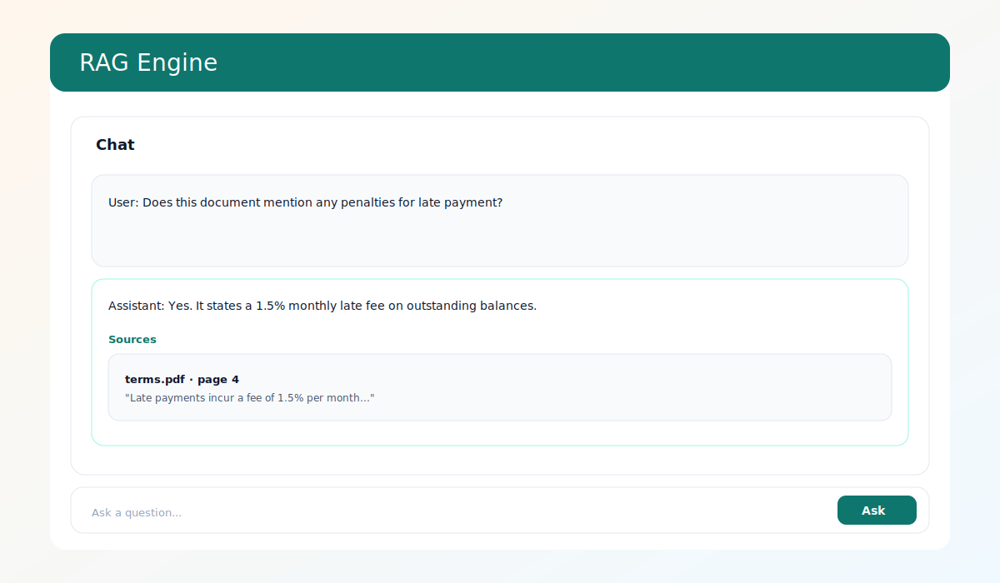

# RAG Engine SaaS (Gemini)

Production-oriented RAG project:
- Backend (FastAPI + SQLite): upload files, chunk + index, semantic retrieval (Gemini embeddings when available), chat Q&A with citations
- Frontend (React + Mantine): session-based workspace, drag/drop upload, chat, and source cards

## UI Preview
Upload + library:


Chat + citations:


## Architecture
- Ingestion: extract -> chunk -> (optional) embed -> store
- Retrieval: cosine similarity over stored embeddings; BM25 lexical fallback if embeddings unavailable
- Generation: Gemini gets question + top-k sources and returns a grounded answer

## Quick Start
### 1) Backend
```bash
cd backend
python3.11 -m venv .venv
source .venv/bin/activate
pip install -r requirements.txt
cp .env.example .env
# set GEMINI_API_KEY
python -m uvicorn app.main:app --reload --host 0.0.0.0 --port 8000
```

### 2) Frontend
```bash
cd frontend
npm install
npm run dev
```

Then open the frontend dev URL and keep backend URL as `http://localhost:8000`.

## Docs
- Backend details: `backend/README.md`
- Frontend details: `frontend/README.md`
- Development: `docs/development.md`
- API: `docs/api.md`
- Architecture: `docs/architecture.md`
- Troubleshooting: `docs/troubleshooting.md`
- Roadmap: `docs/roadmap.md`

## Contributing / Security
- Contributing: `CONTRIBUTING.md`
- Code of Conduct: `CODE_OF_CONDUCT.md`
- Security: `SECURITY.md`
